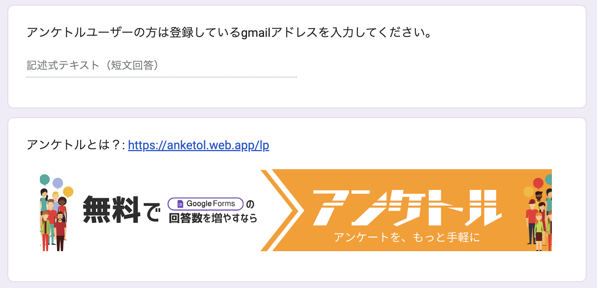

# アンケートの認証方法

#### 1. google フォーム投稿の後、[投稿済みアンケート](https://anketol.web.app/mypage)よりアンケートを認証してください

- google からアンケトルへの権限付与を求められる場合があります。その場合は案内に従いアンケトルに権限を付与してください。
- 認証時にエラーが発生した場合は、[お問い合わせ](https://anketol.web.app/support/contact)よりご連絡ください。

#### 2. 認証完了を確認してください。

1.  アンケトルサイトにて投稿した google フォームの認証ステータスが「認証済み」に変更にされます。（※反映まで数分掛かる可能性がございます。）
2.  該当 google フォーム下部に以下のような設問が追加されます。
    

- この設問は削除しないようにしてください。

#### 3. 他ユーザーの google フォームへの回答の際、上記の質問に回答した上でフォームを送信することで、回答数にカウントすることができます。

#### 4. 認証後も、google フォームは自由に編集いただけます。

- google フォームを作り直した場合には、再度投稿・認証が必要です。
- 上記の設問は削除しないようにしてください。
